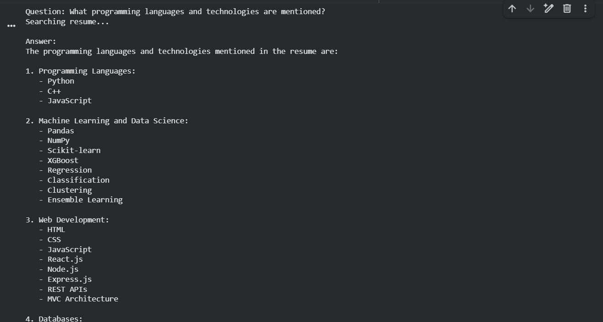
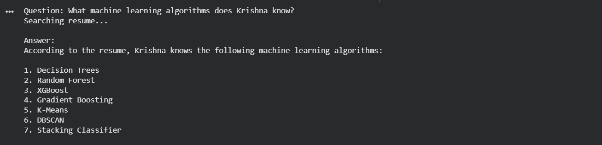
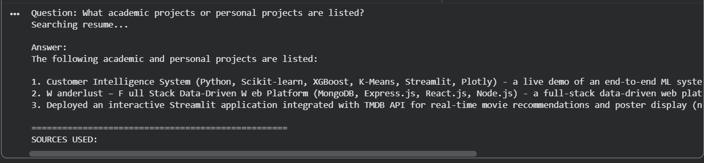

# Document Question Answering System (RAG)

## Overview
This project implements a **Retrieval-Augmented Generation (RAG)** system that allows users to ask questions about their own private documents (in this case, a Resume). 

Instead of relying on general knowledge, the system retrieves specific text chunks from the document and uses an LLM to generate accurate, grounded answers.

## Tech Stack
- Language: Python
- Orchestration: LangChain
- LLM: Groq (Llama 3.1)
- Vector Database: ChromaDB
- Embeddings: HuggingFace (all-MiniLM-L6-v2)
- PDF Parsing: PyPDF

##The Pipeline
1. Ingestion: Load PDF via PyPDFLoader.
2. Chunking: Split text using RecursiveCharacterTextSplitter.
3. Embedding: Convert text to vectors via HuggingFace.
4. Retrieval: Similarity search in ChromaDB.
5. Generation: Llama 3.1 generates the final response.

## 📸Demo / Results
Here is how the system performs when querying my resume:

### Query: What programming languages and technologies are mentioned?"What is the email address?"

### Query: "which machine learning algorithms krishna know?"

### Query: "gives project names which krishna create?"

